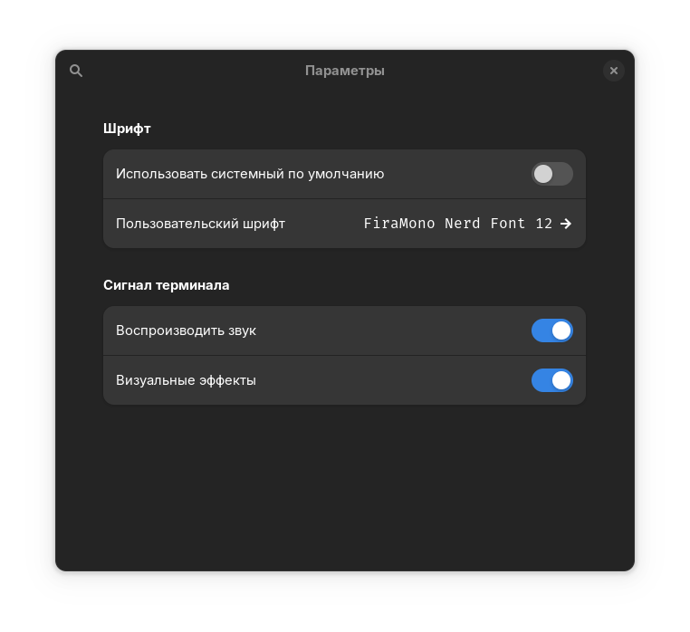
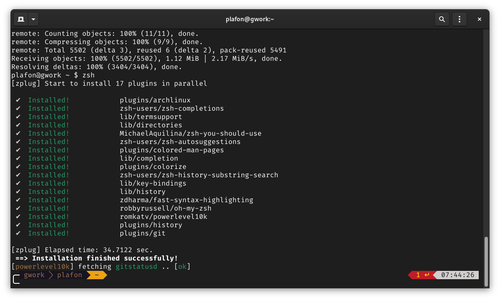
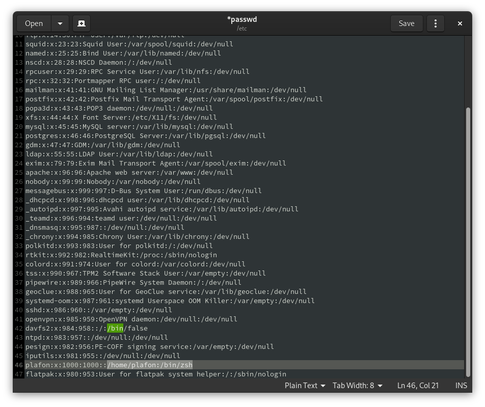
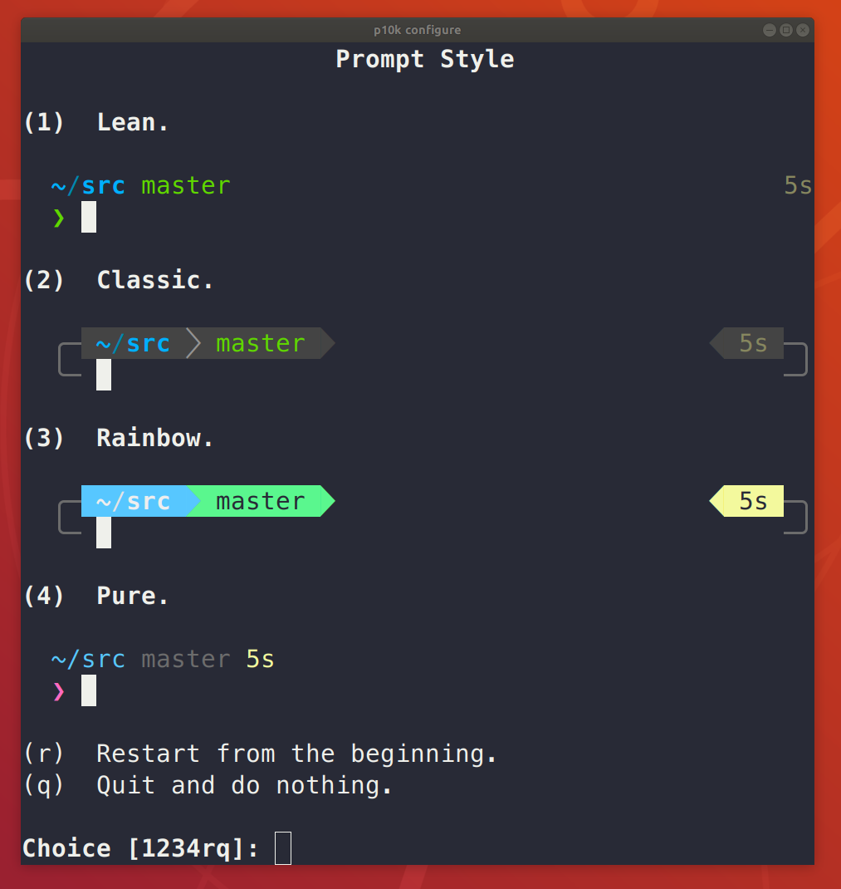

# Beginning
This instruction will help you to make your terminal more beautiful and convenient to use using Zsh and powerlevel10k theme

**Credits: [swzx](https://github.com/swzxu) (adapting for other distro), [PLAFON](https://youtube.com/@plafonlinux) ([ALT Zero project](https://plafon.gitbook.io/alt-zero), .zshrc file), [Toxblh](https://github.com/Toxblh/) ([dotfiles](https://github.com/Toxblh/dotfiles))**

[1. Installing](#Installing)\
[2. Configure](#Configure)\
[3. Aliases](#Aliases)
# Installing
Install Zsh and git package on your distro
Arch Linux - `sudo pacman -Sy zsh git nano`\
Ubuntu, Debian, Mint or other Debian Based Distro - `sudo apt install zsh git nano`\
Fedora - `sudo dnf install zsh git nano`
# Configure
1. Copy **.zshrc** file to your home directory
2. Edit **.zshrc** - find **swzx** and replace with your username
3. Enter this command to your terminal `git clone https://github.com/zplug/zplug ~/.zplug`
4. Download FiraCode.zip and unpack it to .fonts directory in your home
5. Enable this font in your terminal

6. Run Zsh with `zsh` command, it automatically installs all plugins

7. Set Zsh as default shell `sudo nano /etc/passwd`
\
If you want to reconfigure Powerlevel-10k, just type the `p10k-configure` command

# Aliases
> son="sudo systemctl suspend"\
> reboot="systemctl reboot"\
> r="systemctl reboot"\
> ls="ls --color"\
> l="lsd --date '+%d.%m.%Y %H:%M' -lah"
