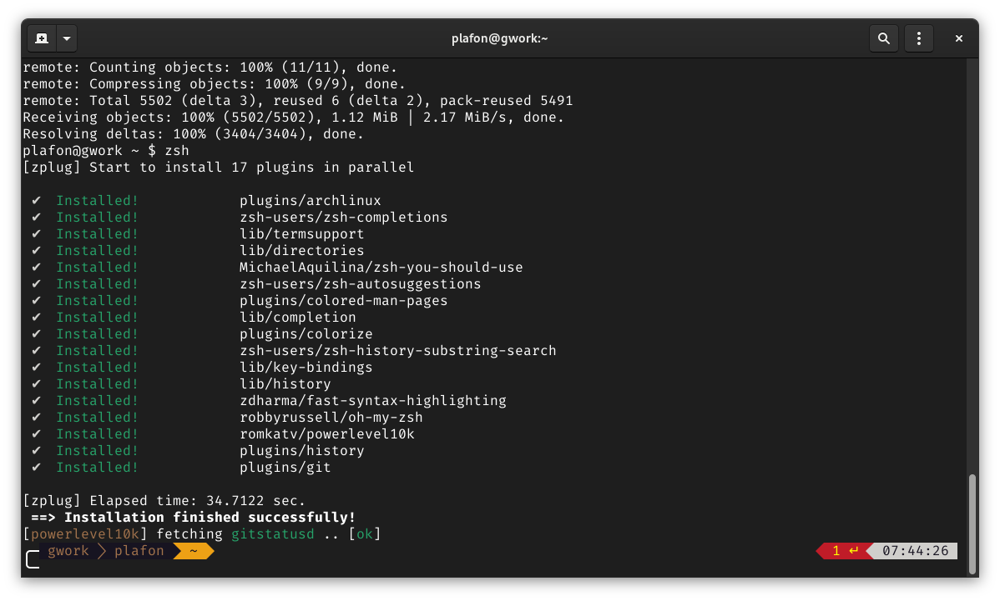
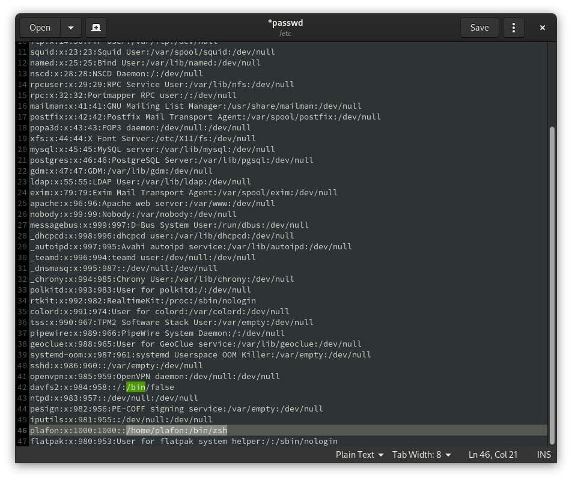

# Начало
Эта инструкция поможет вам сделать ваш терминал более красивым и удобным в использовании, используя Zsh и тему powerlevel10\

**Создатели: [swzx](https://github.com/swzxu) (адаптирование для других дистрибутивов), [PLAFON](https://youtube.com/@plafonlinux) ([Проект Alt-Zero](https://plafon.gitbook.io/alt-zero), .zshrc file), [Toxblh](https://github.com/Toxblh/) ([dotfiles](https://github.com/Toxblh/dotfiles))**

[1. Установка](#Установка)\
[2. Настройка](#Настройка)\
[3. Алиасы](#Алиасы)
# Установка
Установите пакеты zsh и git на ваш дистрибутив.\
Arch Linux - `sudo pacman -Sy zsh git nano`\
Ubuntu, Debian, Mint и другие поделия на основе Debian - `sudo apt install zsh git nano`\
Fedora - `sudo dnf install zsh git nano`
# Настройка
1. Скачайте и скопируйте файл **.zshrc** в вашу домашнюю директорию.
2. Измените **.zshrc** - найдите **swzx** и замените на ваше имя пользователя.
3. Вставьте эту команду в ваш терминал `git clone https://github.com/zplug/zplug ~/.zplug`.
4. Скачайте FiraCode.zip и распакуйте в директорию .fonts в home.
5. Выберите этот шрифт в настройках терминала.

6. Запустите Zsh с помощью команды `zsh`, он автоматически установит все плагины.

7. Установите Zsh как вашу оболочку по-умолчанию в файле passwd `sudo nano /etc/passwd`.
\
Если хотите перенастроить powerlevel10k, то просто введите команду `p10k-configure`.

# Алиасы
> son="sudo systemctl suspend"\
> reboot="systemctl reboot"\
> r="systemctl reboot"\
> ls="ls --color"\
> l="lsd --date '+%d.%m.%Y %H:%M' -lah"
